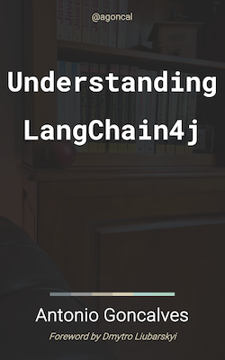

# Awesome [LangChain4j](https://github.com/langchain4j/langchain4j) 

This repository is a space to find and share resources (articles, videos, more elaborate examples, etc.) using the LangChain4j library.
The idea is to allow the community to learn and inspire each other. 

## LangChain4j Community Examples

Here you find all sorts of samples so you can get some inspiration to build application based on these examples or to use them for demo's.
Please read the [usage conditions](#usage-conditions) at the end of this page, and check the license of the project in question before using the examples, and credit the creator.
For the official LangChain4j examples, tutorials and documentation, see [more information](#more-information-on-langchain4j).

We welcome all types of more elaborate examples, such as 
- interesting use cases
- elaborate examples with specific providers, frameworks or set-ups
- experimental programs that push the limits of what is possible with LLMs and AI integration.

| Title                                                                                                                                                                                                                                                | Short Description                                                                                                                                                                                                                                                                                                         | Contributor                                                      | Usage and Extension allowed | Usage for Demos allowed |
|------------------------------------------------------------------------------------------------------------------------------------------------------------------------------------------------------------------------------------------------------|---------------------------------------------------------------------------------------------------------------------------------------------------------------------------------------------------------------------------------------------------------------------------------------------------------------------------|------------------------------------------------------------------|-----------------------------|-------------------------| 
| [Customer Assistant in Spring Boot](https://github.com/langchain4j/langchain4j-examples/blob/cacef9854057f3017ee5405368cd27c446a5df3f/customer-support-agent-example/src/main/java/dev/langchain4j/example/CustomerSupportAgentApplication.java#L39) | Car rental service customer assistant with memory, access to terms of use, and tools to intervene on bookings. Powered by GPT-4.                                                                                                                                                                                          | Dmytro Liubarskyi                                                | ✅                           | ✅                       |  
| [Customer Assistant in Quarkus](https://github.com/geoand/langchain4j-quarkus-example)                                                                                                                                                               | Car rental service customer assistant with memory, access to terms of use, and tools to intervene on bookings. Powered by GPT-4. Including simple frontend.                                                                                                                                                               | Georgios Andrianakis                                             | ✅                           | ✅                       |
| [CoffeShop Chat Assistant in Helidon](https://github.com/helidon-io/helidon-labs/tree/main/hols/langchain4j)                                                                                                                                         | Hands-on lab, showcasing how to build an AI-powered chat assistant for a coffee shop (including RAG) using Helidon and LangChain4J.                                                                                                                                                                                       | Dmitry Kornilov                                                          | ✅                           | ✅                       |
| [Feedback Analyser](https://github.com/LizeRaes/feedback-analyzer)                                                                                                                                                                                   | Example splitting and categorizing feedback with LLM + dashboard and ChatBot to explore the recieved feedback. Quarkus example with as many plain java parts as possible for demo purpose. Includes ChatBot, RAG, metadat filtering, persistence to SQLite database, frontend with form data post, chatbot and dashboard. | Lize Raes and Vincent Peres                                      | ✅                           | ✅                       |  
| [RAG Genie](https://github.com/stephanj/rag-genie)                                                                                                                                                                                                   | LLM RAG prototype to test and evaluate your embeddings, chunk splitting strategies using Q&A and evaluations.                                                                                                                                                                                                             | Stephan Janssen                                                  | ✅                           | ✅                       |
| [LLM Tree-of-Thought](https://github.com/ugwun/tree_of_thought_langchain4j)                                                                                                                                                                          | Explores the implementation of the Tree of Thought (ToT) approach (metacognition) with LLMs. More info [here](https://medium.com/aimonks/metacognition-experiments-with-ai-8ba10f284e4c).                                                                                                                                 | Cyril Sadovsky                                                   | ✅                           | ✅                       |
| [Devoxx Genie IntelliJ Assistant](https://github.com/devoxx/DevoxxGenieIDEAPlugin)                                                                                                                                                                   | Using LangChain4j to build an AI Coding Assistant in IntelliJ that supports local models. Includes code for IntelliJ Plugins.                                                                                                                                                                                             | Devoxx                                                           | ✅                           | ✅                       |
| [Serverless Book Management App (Google Next 24)](https://github.com/GoogleCloudPlatform/serverless-production-readiness-java-gcp/tree/main/sessions/next24/books-genai-vertex-langchain4j)                                                          | Using LangChain4j to build a big serverless book / library management app leveraging Google models and services. Conference slides available [here](https://assets.swoogo.com/uploads/3794515-661c3ba37f784.pdf).                                                                                                         | Dan Dobrin, Yanni Peng                                           | ✅                           | ✅                       | 
| [Build your own ChatGPT in Quarkus (DevoxxFR)](https://github.com/Azure-Samples/azure-openai-rag-workshop)                                                                                                                                           | Workshop to build a chatbot trained with your own pdf's, using Quarkus, LangChain4J and a website to test our chatbot.                                                                                                                                                                                                    | Yohan Lasorsa, Anontio Goncalves, Julien Dubois, Sandra Ahlgrimm | ✅                           | ✅                       |
| [The Petclinic Sample in SpringBoot and Langchain4j](https://github.com/showpune/spring-petclinic-langchain4j)                                                                                                                                       | A chatrobot built with Langchain4j for Spring petclinic, a demo with prompt, memory, RAG, retrieval augmentor and interaction with native functions                                                                                                                                                                       | Zhiyong Li                                                       | ✅                           | ✅                       |
| [The Quarkus Superheroes Sample applcation](https://github.com/quarkusio/quarkus-super-heroes/tree/main/rest-narration)                                                                                                                              | The official Quarkus sample application showcasing integration with OpenAI and Azure OpenAI                                                                                                                                                                                                                               | Eric Deandrea                                                    | ✅                           | ✅                       |
| [langgraph4j library](https://github.com/bsorrentino/langgraph4j)                                                                                                                                                                                    | A library for building stateful, multi-actor applications with LLMs, built for work jointly with langchain4j. _It is a porting of original [langgraph](https://github.com/langchain-ai/langgraph) from [langChain ai project]( https://github.com/langchain-ai) in Java eco-system_.                                      | Bartolomeo Sorrentino                                            | ✅                           | ✅                       |
| [LangChat](https://github.com/TyCoding/langchat)                                                                                                                                                                                                     | LangChat: Java LLMs/AI Project, Supports Multi AI Providers( OpenAI / Gemini / Ollama / Azure / 智谱 / 阿里通义大模型 / 百度千帆大模型), Java生态下AI大模型产品解决方案，快速构建企业级AI知识库、企业机器人                                                                                                                                                            | TyCoding                                                         | ✅                           | ✅                       |
| [Data Extraction with Camel Quarkus](https://github.com/apache/camel-quarkus-examples/tree/main/data-extract-langchain4j)                                                                                                                            | Turns unstructured text coming from a source system into Java objects                                                                                                                                                                                                                                                     | Alexandre Gallice                                                | ✅                           | ✅                       |
| [Amazon Bedrock: Leveraging Foundation Models With Quarkus and AWS](https://dzone.com/articles/amazon-bedrock-leveraging-foundation-models-with-q)                                                                                                   | A Generative AI Gateway with Amazon Bedrock, Quarkus and Langchain4J.                                                                                                                                                                                                                                                     | Nicolas Duminil                                                  | ✅                           | ✅                       |
| [The Power of LLMs in Java: Leveraging Quarkus and LangChain4j](https://dzone.com/articles/leveraging-the-llm-power-in-java)                                                                                                                         | A Haiku Generator with Quarkus and Langchain4J.                                                                                                                                                                                                                                                                           | Nicolas Duminil                                                  | ✅                           | ✅                       |
| [langchain4j-aideepin](https://github.com/moyangzhan/langchain4j-aideepin)                                                                                                                                                                           | Ai-based productivity tools (Chat,Draw,RAG etc).    基于AI的工作效率提升工具                                                                                                                                                                                                                                                      | moyangzhan                                                       | ✅                           | ✅                       |

## LangChain4j Books

| Publication Date | Cover                                                                                 | Title                                                                                        | Short Description                                                                                                                                                                                                                                                                                                                                                                                                                                                                                                                                                                                                                  | Author                                                 |
|------------------|---------------------------------------------------------------------------------------|----------------------------------------------------------------------------------------------|------------------------------------------------------------------------------------------------------------------------------------------------------------------------------------------------------------------------------------------------------------------------------------------------------------------------------------------------------------------------------------------------------------------------------------------------------------------------------------------------------------------------------------------------------------------------------------------------------------------------------------|--------------------------------------------------------| 
| 2025/06/23       |  | [Understanding LangChain4j (2nd Edition)](https://agoncal.teachable.com/p/ebook-understanding-langchain4j) | In this book, you will learn LangChain4j, the Java library that simplifies the integration of AI and LLMs into your applications. You will explore the fundamentals of AI, learn the history and evolution of AI models, and understand the core concepts of LangChain4j. From accessing and invoking large language models to manipulating embeddings in vector databases or accessing MCP servers, you will gain hands-on experience through practical examples and code snippets. Additionally, you will discover advanced topics such as Retrieval-Augmented Generation (RAG), debugging, testing, and integrating LangChain4j with other technologies. | [Antonio Goncalves](https://amazon.com/author/agoncal) |  

## Other LangChain4j Community Resources

Here you find all sorts resources (articles, tutorials, videos, etc.) sorted by date on LangChain4j.

| Date       | Type    | Title                                                                                                                                                                                                                                            | Short Description                                                                                                                                                                                                                                                                                                                                       | Author                  |
|------------|---------|--------------------------------------------------------------------------------------------------------------------------------------------------------------------------------------------------------------------------------------------------|---------------------------------------------------------------------------------------------------------------------------------------------------------------------------------------------------------------------------------------------------------------------------------------------------------------------------------------------------------|-------------------------| 
| 2025/05/16 | Article | [Building AI Assistant Application in Helidon](https://dmitrykornilov.net/2025/05/16/building-ai-assistant-application-in-java/)                                                                                                                 | This tutorial demonstrates how to implement Helidon Assistant — a chatbot, ully functional & practical AI-powered Java application with a web UI, trained to answer questions about the Helidon framework.                                                                                                                                              | Dmitry Kornilov         |  
| 2024/08/22 | Article | [LLMs streaming with AI Endpoints and LangChain4j](https://blog.ovhcloud.com/llms-streaming-with-ai-endpoints-and-langchain4j/)                                                                                                                  | This tutorial demonstrates how to implement a streaming chatbot using LangChain4J and OVHcloud AI Endpoints.                                                                                                                                                                                                                                            | Stéphane Philippart     |  
| 2024/08/22 | Article | [Memory chatbot using AI Endpoints and LangChain4j](https://blog.ovhcloud.com/memory-chatbot-using-ai-endpoints-and-langchain4j/)                                                                                                                | This tutorial demonstrates how to implement a chatbot using LangChain4J and OVHcloud AI Endpoints.                                                                                                                                                                                                                                                      | Stéphane Philippart     |  
| 2024/08/20 | Article | [Using RAG with LangChain4j and PostgreSQL Vector](https://blog.ovhcloud.com/rag-chatbot-using-ai-endpoints-and-langchain4j/)                                                                                                                    | This tutorial demonstrates how to implement RAG using LangChain4J ContentRetriever and a PosgreSQL database to store vectors.                                                                                                                                                                                                                           | Stéphane Philippart     |  
| 2024/08/22 | Article | [How to use AI Endpoints and LangChain4j](https://blog.ovhcloud.com/how-to-use-ai-endpoints-and-langchain4j/)                                                                                                                                    | This tutorial demonstrates how to use LangChain4J and OVHcloud AI Endpoints.                                                                                                                                                                                                                                                                            | Stéphane Philippart     |
| 2024/08/20 | Article | [LangChain4J Spring Boot ContentRetriever tutorial](https://medium.com/@cyrilsadovsky/langchain4j-spring-boot-contentretriever-tutorial-212da8b5c50d)                                                                                            | This tutorial demonstrates how to implement LangChain4J ContentRetriever in a Spring Boot application. The concepts covered can be applied to any RAG (Retrieval-Augmented Generation) paradigm.                                                                                                                                                        | Cyril Sadovsky          |  
| 2024/08/15 | Article | [Building a Desktop AI Chat Application with LangChain4j and Install4j](https://java-ai.hashnode.dev/building-a-desktop-ai-chat-application-with-langchain4j-and-install4j)                                                                      | A short article discussing how to use LangChain4j and Install4j to create a simple AI-backed desktop application.                                                                                                                                                                                                                                       | Rob Brown               |  
| 2024/08/04 | Article | [Using RAG with Langchain4j and Ollama3](https://www.mastertheboss.com/various-stuff/ai/using-rag-with-langchain4j-and-ollama3/)                                                                                                                 | Retrieval-Augmented Generation (RAG) is a framework that enhances the capabilities of generative language models by incorporating relevant information retrieved from a large corpus of documents. This combination helps improve the accuracy and relevance of the generated responses. In this article we will learn how to use RAG with Langchain4j. | F. Marchioni            |  
| 2024/07/09 | Article | [Long Document Summarization Techniques with Java, Langchain4J and Gemini models](https://medium.com/google-cloud/long-document-summarization-techniques-with-java-langchain4j-and-gemini-models-750f6c60b379)                                   | Suppose your organization has a large number of documents, in various formats, and you, a Java developer, are tasked to efficiently summarize the content of each document.                                                                                                                                                                             | Dan Dobrin              |  
| 2024/06/08 | Article | [Straightforward, Gemini powered sentiment analysis with Langchain4J](https://medium.com/@aaronmwanjala/straightforward-gemini-powered-sentiment-analysis-with-langchain4j-b8245de01d6b)                                                         | Sentiment analysis determines if a text is positive, negative, or neutral, helping businesses understand customer feelings and individuals track topic sentiment over time. A simple implementation uses an LLM as a classifier, demonstrated here with Gemini 1.5 Flash.                                                                               | Aaron Wanjala           |  
| 2024/06/06 | Article | [Introducing LangChain4j Integration with E.D.D.I: Connecting multiple LLMs with one AI Middleware](https://labsai.medium.com/introducing-langchain4j-integration-with-e-d-d-i-connecting-multiple-llms-with-one-ai-middleware-99d1dc987ce4)     | With the integration of LangChain4j, E.D.D.I now seamlessly connects with powerful LLM APIs like OpenAI ChatGPT, Facebook Hugging Face, Anthropic Claude, Google Gemini, and Ollama. This enhancement expands E.D.D.I’s capabilities, enabling developers and businesses to leverage top AI technology for their applications.                          | Gregor Jarisch          |  
| 2024/06/05 | Article | [Step-by-Step Guide to Building a FullStack LangChain4j Application](https://chalise-arun.medium.com/step-by-step-guide-to-building-a-fullstack-langchain4j-application-0dfd4f0ef7bc)                                                            | In this tutorial we will build a full stack LangChain application using LangChain4J, SpringBoot and ReactJS                                                                                                                                                                                                                                             | Arun Chalise            |  
| 2024/06/03 | Article | [Let's make Gemini Groovy!](https://glaforge.dev/posts/2024/06/03/lets-make-gemini-groovy/)                                                                                                                                                      | The happy users of Gemini Advanced, the powerful AI web assistant powered by the Gemini model, can execute some Python code, thanks to a built-in Python interpreter. So, for math, logic, calculation questions, the assistant can let Gemini invent a Python script, and execute it, to let users get a more accurate answer to their queries.        | Guillaume Laforge       |  
| 2024/05/28 | Article | [Grounding Gemini with Web Search results in LangChain4j](https://glaforge.dev/posts/2024/05/28/grounding-gemini-with-web-search-in-langchain4j/)                                                                                                | The latest release of LangChain4j (version 0.31) added the capability of grounding large language models with results from web searches. There’s an integration with Google Custom Search Engine, and also Tavily.                                                                                                                                      | Guillaume Laforge       |  
| 2024/05/03 | Article | [Gemini, Google's Large Language Model, for Java Developers](https://glaforge.dev/talks/2024/05/03/gemini-google-large-language-model-for-java-developers/)                                                                                      | As a follow-up to my talk on generative AI for Java developers, I’ve developed a new presentation that focuses more on the Gemini large multimodal model by Google.                                                                                                                                                                                     | Guillaume Laforge       |  
| 2024/04    | Video   | [LangChain4J - use the power of LLMs in Java!](https://www.youtube.com/watch?v=x8kkjmCZTaw)                                                                                                                                                      | An introduction to LangChain4J : what it is, why use it, with 7 short demos showing its main use cases in Java. We'll use Azure OpenAI and MistralAI, Dalle-3, GPT-4 and Mistral 7B, learn how to use embeddings and vector databases, and how to use the RAG pattern.                                                                                  | Julien Dubois           |  
| 2024/04/16 | Article | [Building a simple AI assistant with Spring Boot and LangChain4j](https://medium.com/comsystoreply/building-a-simple-ai-assistant-with-spring-boot-and-langchain4j-a9693b1cddfc)                                                                 | This blog explains how to build an AI assistant using Spring Boot and LangChain4j. The assistant will use OpenAI's ChatGPT to provide users with information about charging stations for electric vehicles.                                                                                                                                             | Filip Gustetić          |  
| 2024/04/03 | Article | [Calling Gemma with Ollama, TestContainers, and LangChain4j](https://glaforge.dev/posts/2024/04/04/calling-gemma-with-ollama-and-testcontainers/)                                                                                                | Lately, for my Generative AI powered Java apps, I’ve used the Gemini multimodal large language model from Google. But there’s also Gemma, its little sister model.                                                                                                                                                                                      | Guillaume Laforge       |  
| 2024/03/27 | Article | [Java + Ollama — Unlock capability of Generative AI to Java developer with LangChain4j (Model on locally)](https://tpbabparn.medium.com/java-ollama-unlock-capability-of-generative-ai-to-java-developer-with-langchain4j-model-on-c814f97d9676) | Generative AI can generate text, images, songs, and videos. The Java community has introduced "LangChain4j" as a way to communicate with LLMs, serving as an alternative to LangChain for Java.                                                                                                                                                         | Thanaphoom Babparn      |  
| 2024/03/27 | Article | [Gemini codelab for Java developers using LangChain4j](https://glaforge.dev/posts/2024/03/27/gemini-codelab-for-java-developers)                                                                                                                 | No need to be a Python developer to do Generative AI! If you’re a Java developer, you can take advantage of LangChain4j to implement some advanced LLM integrations in your Java applications. And if you’re interested in using Gemini, one of the best models available, I invite you to have a look at the following “codelab” that I worked on.     | Guillaume Laforge       |  
| 2024/03/03 | Video   | [GenAI with Quarkus, Langchain4j and Ollama !](https://www.youtube.com/watch?v=TYH95_Vzvzw)                                                                                                                                                      | Let's see how we can see up an dev environment , all running locally using cool technologies like Quarkus, langchain4j and Ollama                                                                                                                                                                                                                       | Sebastien Blanc         |  
| 2024/03    | Video   | [Java Meets AI: How to build LLM-Powered Applications with LangChain4j](https://www.youtube.com/watch?v=Ewr1KYPtLa0)                                                                                                                             | Do you want to build applications powered by Large Language Models (LLMs) using Java and Spring Boot?                                                                                                                                                                                                                                                   | Lize Raes               |  
| 2024/03    | Video   | [The Definitive Guide to Tool Support in LangChain4J](https://www.youtube.com/watch?v=cjI_6Siry-s)                                                                                                                                               | LangChain4J lets you add classes and methods that an AI model can invoke automatically. That allows you to supply functions that do well what the AI model does badly.                                                                                                                                                                                  | Tales from the jar side |  
| 2024/03    | Video   | [Unleashing AI in Java: A Guide to Semantic Kernel, LangChain4j, and Spring AI](https://www.youtube.com/watch?v=qL9A21N-6J4)                                                                                                                     | Are you a Java developer curious about building AI apps, but feel restricted by the prevalence of Python and JavaScript tools? This talk is for you. We'll explore Java AI libraries like Semantic Kernel, LangChain4j, and Spring AI, demystifying how to get started with AI engineering right within your favorite language.                         | Marcus Hellberg         |  
| 2024/02/26 | Article | [LangChain4j Retrieval-Augmented Generation (RAG) Tutorial](https://www.sivalabs.in/langchain4j-retrieval-augmented-generation-tutorial)                                                                                                         | Understand the need for Retrieval-Augmented Generation (RAG). Learn about EmbeddingModel, EmbeddingStore, DocumentLoaders, and EmbeddingStoreIngestor. Explore working with different EmbeddingModels and EmbeddingStores, ingesting data into EmbeddingStore, and querying LLMs with data from EmbeddingStore.                                         | Siva Prasad Reddy       |  
| 2024/02/23 | Article | [LangChain4j AiServices Tutorial](https://www.sivalabs.in/langchain4j-ai-services-tutorial)                                                                                                                                                      | Learn to use LangChain4j AiServices for interacting with LLMs. Discover how to ask questions and map responses to different formats. Understand how to summarize text in various formats and analyze the sentiment of the given text.                                                                                                                   | Siva Prasad Reddy       |  
| 2024/02/21 | Article | [Generative AI Conversations using LangChain4j ChatMemory](https://www.sivalabs.in/generative-ai-conversations-using-langchain4j-chat-memory)                                                                                                    | Learn to use LangChain4j's ChatMemory and ConversationalChain for creating conversation-style interactions. Discover how to ask questions effectively using PromptTemplate for precise and context-aware responses.                                                                                                                                     | Siva Prasad Reddy       |  
| 2024/02/19 | Article | [Getting Started with Generative AI using Java, LangChain4j, OpenAI and Ollama](https://www.sivalabs.in/getting-started-with-generative-ai-using-java-langchain4j-openai-ollama)                                                                 | In this article, we'll cover the basics of Generative AI, how to interact with OpenAI APIs using Java, and how to use LangChain4j. We'll also explain running a local LLM model with Ollama and integrating Ollama with LangChain4j and Testcontainers.                                                                                                 | Siva Prasad Reddy       |  
| 2024/02/01 | Article | [Image generation with Imagen and LangChain4j](https://glaforge.dev/posts/2024/02/01/image-generation-with-imagen-and-langchain4j)                                                                                                               | This week LangChain4j, the LLM orchestration framework for Java developers, released version 0.26.1, which contains my first significant contribution to the open source project: support for the Imagen image generation model.                                                                                                                        | Guillaume Laforge       |
| 2024/01/23 | Video   | [ Crafting Intelligent Supersonic Subatomic applications with Quarkus](https://www.youtube.com/watch?v=ubZtXfwG6ec)                                                                                                                              | Learn Learn how Quarkus embraces the AI/LLM universe by integrating with the popular langchain4j library, and get ideas for crafting your own intelligent applications! Recorded at Voxxed Days CERN 2024                                                                                                                                               | Dimitris Andreadis      |
| 2023/12    | Video   | [How to build a retrieval-augmented generation (RAG) AI system in Java (Spring Boot + LangChain4j)](https://www.youtube.com/watch?v=J-3n7xs98Kc)                                                                                                 | Learn how to build an AI powered application that knows your business context and is able to interact with your Java code. Recorded at Vaadin Create 2023.                                                                                                                                                                                              | vaadinofficial          |  
| 2023/11/13 | Article | [Generative AI in practice: Concrete LLM use cases in Java, with the PaLM API](https://glaforge.dev/talks/2023/11/13/gen-ai-with-palm-2-and-java)                                                                                                | Large Language Models, available through easy to use APIs, bring powerful machine learning tools in the hands of developers. Although Python is usually seen as the lingua franca of everything ML, with LLM APIs and LLM orchestration frameworks, complex tasks become easier to implement for enterprise developers.                                 | Guillaume Laforge       |  
| 2023/11/16 | Video   | [Fireside Chat: LangChain4j & Quarkus](https://www.youtube.com/watch?v=mYw9ySwmK34)                                                                                                                                                              | [When Quarkus meets LangChain4j](https://quarkus.io/blog/quarkus-meets-langchain4j/)                                                                                                                                                                                                                                                                    | Quarkus team            |  
| 2024/04/29 | Video   | [Quarkus Insights #163: Latest in Quarkus LangChain4j](https://www.youtube.com/watch?v=EeR_8HMFwN4)                                                                                                                                              | Dimitrios Andreadis & Georgios Andrianakis join us to discuss the latest happenings with LangChain4j, including MistralAI and Easy RAG in Quarkus.                                                                                                                                                                                                      | Quarkus team            |  
| 2023/11/05 | Video   | [The Magic of AI Services with LangChain4j](https://www.youtube.com/watch?v=Bx2OpE1nj34)                                                                                                                                                         | LangChain4J is a port of the Python project LangChain to the Java world. It has many capabilities, but one particularly useful one is that it can generate AI “services” from a simple interface that interact with whatever language model you choose.                                                                                                 | Ken Kousen              |  

## Usage Conditions

**For users:**
Please check the README of the example and make sure you use it only as allowed by the permissions

**For contributors:**
If you have an inspiring application that you want to share with the community, you're very welcome to add it here, either by committing the code or by adding a link in the table below.
Please make sure your project compiles and runs correctly. Please provide a README explaining what your example does, how to run it, and which of the following permissions you grant:
- permission to get inspired and make a similar app
- permission to use the example for demos, while crediting you
- permission to use and extend the application

## More information on LangChain4J
- [Repository](https://github.com/langchain4j/langchain4j)
- [Documentation](https://docs.langchain4j.dev/)
- [Standard Examples](https://github.com/langchain4j/langchain4j-examples)
- [Tutorials](https://github.com/langchain4j/langchain4j-examples/tree/main/tutorials/src/main/java)
